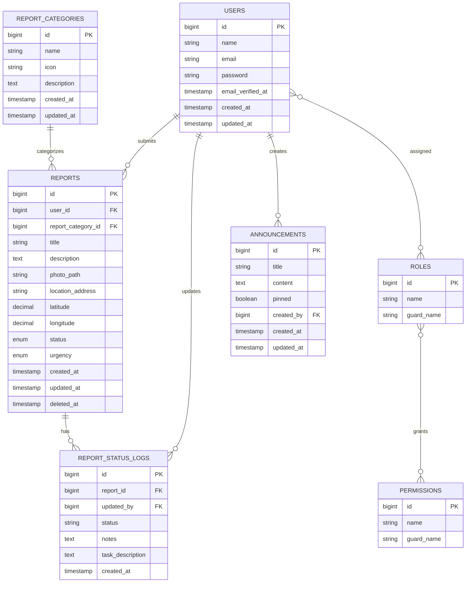

# Entity Relationship Diagram (ERD)

Diagram berikut menggambarkan struktur basis data utama pada aplikasi **SIGAP (Sistem Informasi Gangguan dan Aspirasi Publik)**. Sistem dibangun menggunakan **Laravel 13**, **Laravel Sanctum**, dan **Spatie Laravel Permission**.

## Notes

- Authentication uses **Laravel Sanctum**.
- Authorization uses **Spatie Laravel Permission**.
- Soft Deletes are implemented on the `reports` table.
- Each report belongs to one category and one user.
- Each report stores a history of status changes in `report_status_logs`.
- Admin users can publish announcements visible to all citizens.