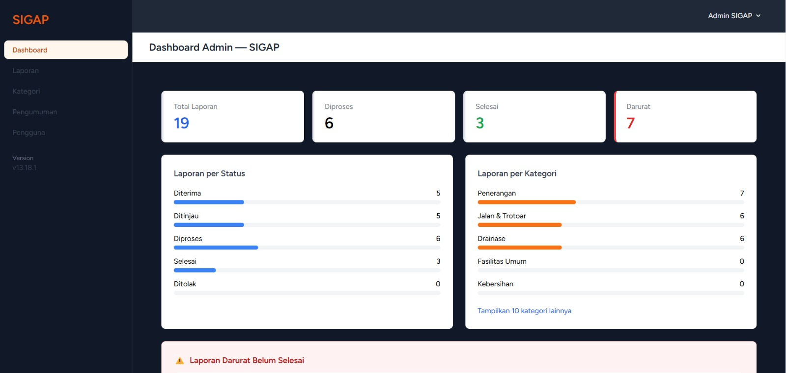
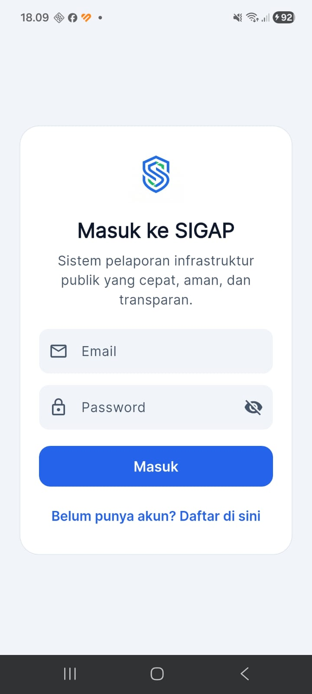
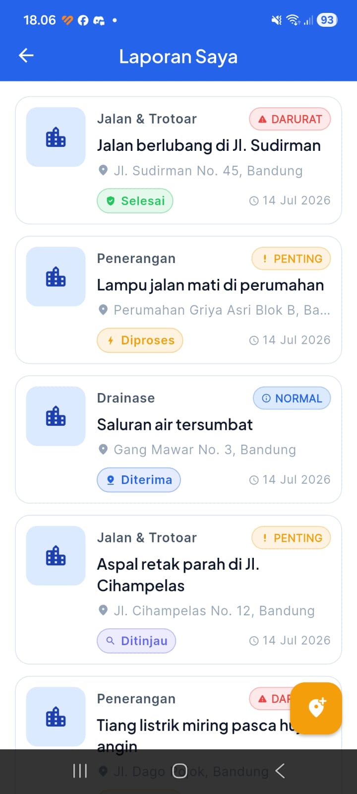

# SIGAP — Sistem Informasi Gangguan dan Aspirasi Publik

Aplikasi pelaporan kerusakan infrastruktur publik berbasis **client-server**, terdiri dari dashboard admin web (Laravel) dan aplikasi mobile (Flutter) yang terhubung melalui REST API.

> Proyek Akhir Semester — Pemrograman Web Berbasis Framework (PWBF) × Pemrograman Perangkat Bergerak Client Server (PPBCS)
> Universitas Muhammadiyah Bandung — 2025/2026

---

## 📋 Fitur Utama

### Web Admin (Laravel)
- Autentikasi & manajemen role-permission (Admin / Warga)
- Dashboard statistik: total laporan, in progress, selesai, darurat
- Manajemen Laporan: list, filter, search, pagination, detail, update status & urgensi
- Track record perubahan status per laporan (timeline)
- Manajemen Kategori: CRUD lengkap
- Manajemen Pengguna: list, ubah role, hapus
- Recycle Bin: restore & hapus permanen (soft delete)
- REST API dengan Laravel Sanctum

### Mobile App (Flutter)
- Login & Register
- Dashboard ringkas laporan milik sendiri
- Buat laporan baru (judul, kategori, deskripsi, lokasi, foto, urgensi)
- List laporan dengan status badge berwarna
- Detail laporan + track record timeline
- Edit laporan (hanya jika status masih "Diterima")
- Hapus laporan
- Edit profil

---

## 🛠️ Tech Stack

| Bagian | Teknologi |
|---|---|
| Backend | Laravel 13, PHP 8.3, MySQL 8 |
| Frontend Web | Blade, Tailwind CSS, Laravel Breeze |
| Auth & Permission | Laravel Sanctum, Spatie Permission |
| Mobile | Flutter, Dart |
| State Management | Provider |
| HTTP Client | package `http` |
| Local Storage | `shared_preferences` |
| Media | `image_picker`, `geolocator` |
| Version Control | Git, GitHub |

---

## 📁 Struktur Project
sigap/
├── sigap-laravel/     ← Backend & Web Admin (Laravel 13)
├── sigap-flutter/     ← Mobile App (Flutter)
├── Laporan/           ← Dokumen laporan ilmiah
├── ERD.md             ← Entity Relationship Diagram
└── README.md
---

## ⚙️ Instalasi & Menjalankan Project

### Prasyarat
- PHP >= 8.2
- Composer
- Node.js & NPM
- MySQL
- Flutter SDK
- Git

---

### Laravel (Web Admin)

```bash
# 1. Clone repository
git clone https://github.com/[username]/sigap.git
cd sigap/sigap-laravel

# 2. Install dependencies
composer install

# 3. Salin file environment
cp .env.example .env

# 4. Generate application key
php artisan key:generate
```

Edit file `.env` sesuaikan bagian berikut:
```env
APP_NAME=SIGAP
APP_URL=http://localhost:8000

DB_CONNECTION=mysql
DB_HOST=127.0.0.1
DB_PORT=3306
DB_DATABASE=sigap
DB_USERNAME=root
DB_PASSWORD=
```

```bash
# 5. Buat database 'sigap' di MySQL, lalu jalankan migration & seeder
php artisan migrate --seed

# 6. Buat symbolic link untuk storage foto
php artisan storage:link

# 7. Install & build assets
npm install && npm run build

# 8. Jalankan server
php artisan serve
# → http://localhost:8000
```

---

### Flutter (Mobile App)

```bash
# 1. Masuk ke folder Flutter
cd sigap/sigap-flutter

# 2. Install dependencies
flutter pub get

# 3. Sesuaikan base URL di lib/config.dart
```

```dart
// Untuk Android Emulator
static const String baseUrl = 'http://10.0.2.2:8000/api/v1';

// Untuk device fisik (sesuaikan dengan IP lokal komputer)
// static const String baseUrl = 'http://192.168.x.x:8000/api/v1';

// Untuk iOS Simulator
// static const String baseUrl = 'http://127.0.0.1:8000/api/v1';
```

```bash
# 4. Pastikan Laravel sudah berjalan, lalu jalankan Flutter
flutter run
```

---

## 👥 Akun Default

| Email | Password | Role |
|---|---|---|
| admin@sigap.com | password | Admin |
| warga@sigap.com | password | User (Warga) |

---

## 📸 Screenshot


Dashboard Admin


Mobile Login


Mobile Laporan


> Screenshot dapat dilihat pada video demo berikut.

---

## 🎥 Video Demo & Presentasi

| Tautan | Keterangan |
|---|---|
| [▶️ Video Demo (YouTube)](https://youtu.be/7xfF5m7Rz3I) | Demo seluruh fitur web & mobile |
| [📊 Slide Presentasi (Canva)](https://canva.link/dkdmoffgodfsly7) | Slide presentasi tugas besar |

---

## 🗄️ API Endpoints

### Auth

| Method | Endpoint | Deskripsi | Auth |
|---|---|---|---|
| POST | `/api/v1/login` | Login user/admin | ❌ |
| POST | `/api/v1/register` | Registrasi warga | ❌ |
| POST | `/api/v1/logout` | Logout | ✅ |

### Profile

| Method | Endpoint | Deskripsi | Auth |
|---|---|---|---|
| GET | `/api/v1/profile` | Lihat profil | ✅ |
| PUT | `/api/v1/profile` | Update nama profil | ✅ |
| GET | `/api/v1/me` | Data user login | ✅ |

### Reports

| Method | Endpoint | Deskripsi | Auth | Role |
|---|---|---|---|---|
| GET | `/api/v1/reports` | List laporan | ✅ | Semua |
| POST | `/api/v1/reports` | Buat laporan baru | ✅ | User |
| GET | `/api/v1/reports/{id}` | Detail laporan | ✅ | Semua |
| PUT | `/api/v1/reports/{id}` | Edit laporan | ✅ | User (owner) |
| DELETE | `/api/v1/reports/{id}` | Hapus laporan | ✅ | User (owner) |
| PUT | `/api/v1/reports/{id}/status` | Update status | ✅ | Admin |

### Categories

| Method | Endpoint | Deskripsi | Auth |
|---|---|---|---|
| GET | `/api/v1/categories` | List kategori | ✅ |

### Contoh Request Body

**Login:**
```json
{
  "email": "admin@sigap.com",
  "password": "password"
}
```

**Buat Laporan (multipart/form-data):**
title            : Jalan berlubang
description      : Terdapat lubang besar di tengah jalan
category_id      : 1
location_address : Jl. Sudirman No. 45
urgency          : darurat
photo            : [file gambar, opsional]

**Update Status (Admin):**
```json
{
  "status": "in_progress",
  "notes": "Sedang ditangani",
  "task_description": "Tim Dinas PU sedang melakukan perbaikan"
}
```

---

## 👨‍💻 Tim Pengembang

| Nama | NIM |
| Muhammad Narendra Gema Akbar Raihan | 230102091 |
| Zakqi Ramadhan | 230102129 |
| M. SAKTI GABITA | 230102131 |
| Andreansyah Rahmattullah | 240102015 |

---

## 📄 Laporan

Dokumen laporan ilmiah tersedia di folder [`Laporan/`](./Laporan/).

---

## 📝 Lisensi

Proyek ini dibuat untuk keperluan akademik — Tugas Besar Semester Genap 2025/2026.